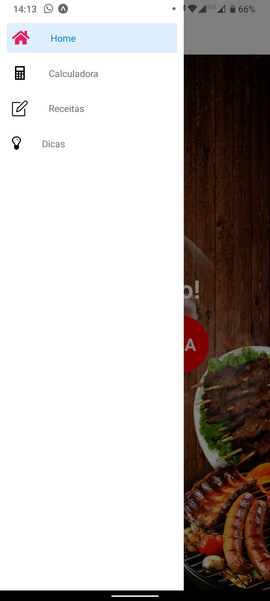
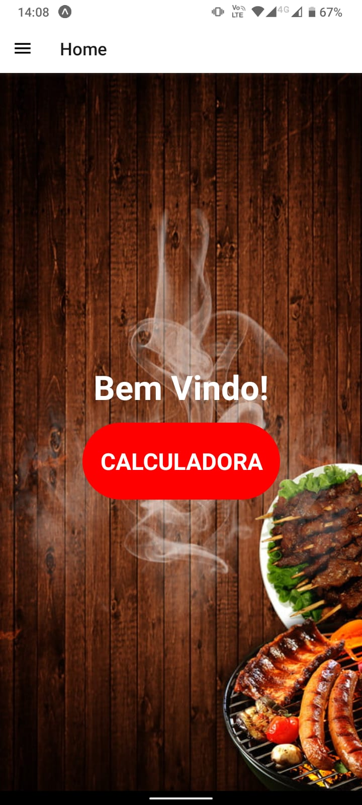
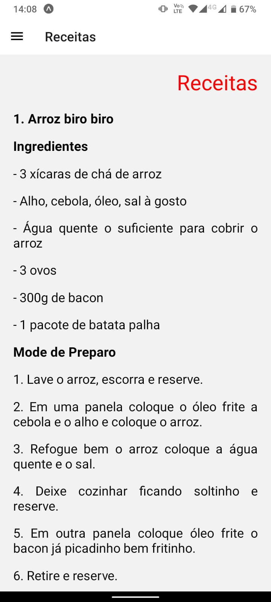
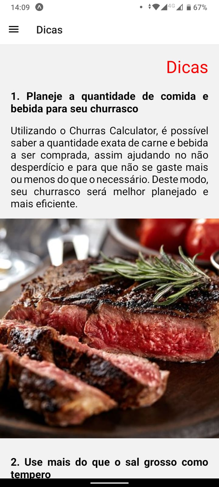
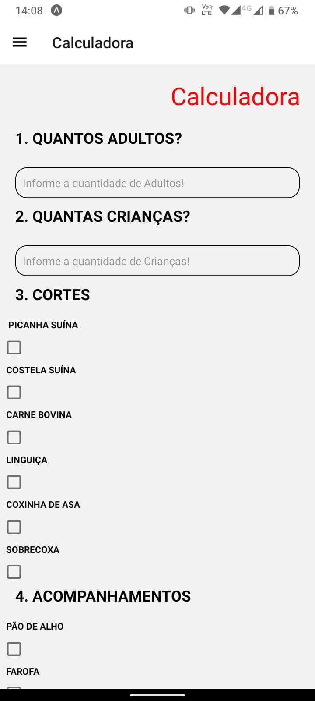

<h1 align="center">Churrascometro</h1>
 <h4 align="center"> 
	🚧  App Mobile  🚀 Incompleto ❗
</h4>

Projeto feito para auxiliar no planejamento de preços gastos em um churrasco. App para celular.

 Projeto organizado no trello usando o método kanban pelo grupo Nexus, na rede Senai. 

Tabela de conteúdos
=================
<!--ts-->
   * Features
   * Pré-Requisitos
   * Tecnologias
   * Site
   * Contribuidores 
   * Docente
<!--te-->

<h2>Features</h2>

- [x] Menu Lateral 

### Pré-requisitos

Antes de começar, você irá precisar ter instalado em sua máquina a seguinte ferramenta:
[Git](https://git-scm.com). 
Além disto é recomendável utilizar um editor para trabalhar com o código como [VSCode](https://code.visualstudio.com/)
Ter instalado o [NodeJS](https://nodejs.org/en/)
Instalar o  [Expo](https://docs.expo.dev/get-started/installation/) em sua máquina 
### 🛠 Tecnologias

As seguintes ferramentas foram usadas na construção do projeto:

- JavaScript
- React-Native
- Bibliotecas de icon's

## Site 

 Menu lateral usado no App 

<h1 align="center">
  
</h1>

 Página Inicial / Home 

<h1 align="center">
  
</h1>

 Página De Receitas

<h1 align="center">
  
</h1>

 Páginas de Dicas 

<h1 align="center">
  
</h1>

 Página da Calculadora 

<h1 align="center">
  
</h1>

## 👨‍💻 Contribuidores

- Vitor Benedito -> Front End 
- Paulo Rondon -> Markdown, WireFrame inicial
- Paulo Willyan -> BackEnd, FrontEnd,
- Marcos Arambasic -> Pit, WireFrame Final e pequisas de campo,
- Matheus Costa -> BackEnd
- Matheus Reis -> BackEnd

## 👨‍🏫 Docente
Atila Andreatti
